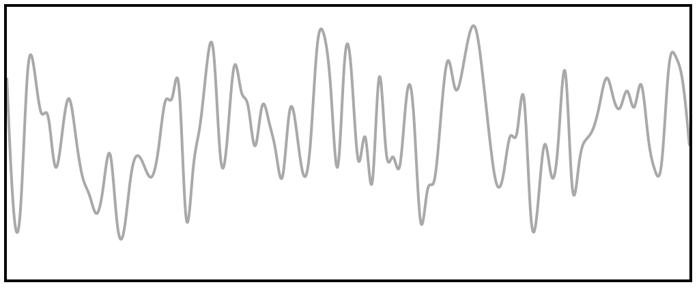
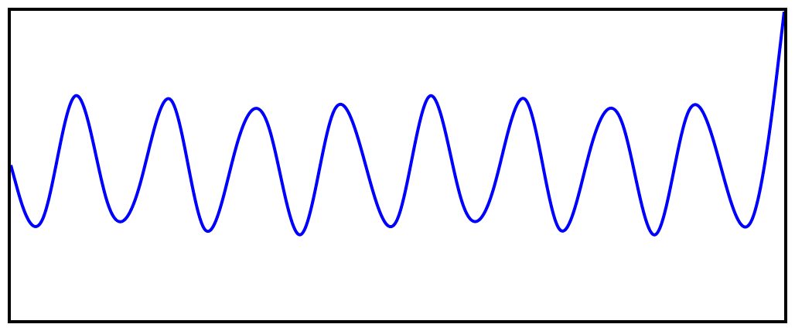
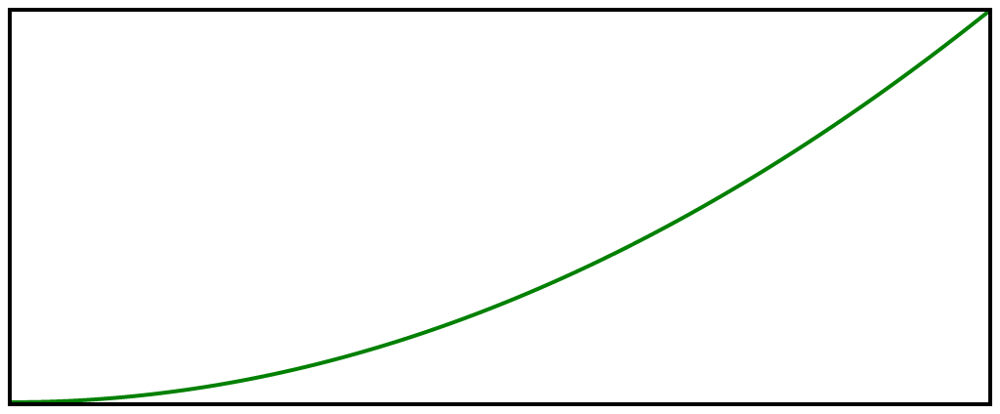
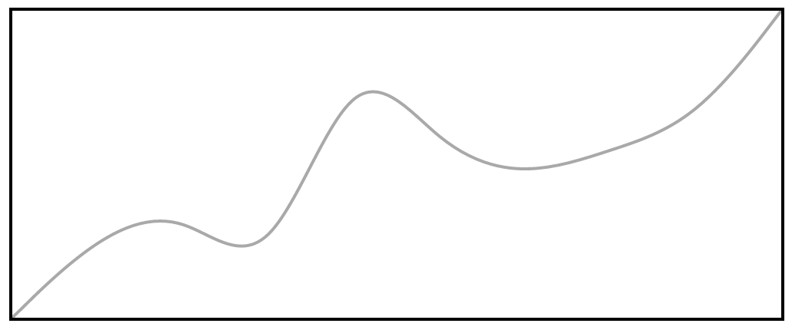

[![Travis Status][trav_img]][trav_site]


Victory Line
============

`victory-line` draws an SVG line on your screen. Unlike core `d3`, it can graph
functions or passed in data, from a clean `React` interface. Style, data,
interpolate, scale -- all can be overridden by passing in new values.

## Examples

The plain component comes with a random data generator, so rendering will
produce *some* output.

This:

``` javascript
<VictoryLine />
```

Gets you this:



Styles can be overridden by passing them in as a map. Also, we can graph
arbitrary equations.

So this:

``` javascript
<VictoryLine style={{stroke: "blue"}}
y={(x) => Math.sin(x)}
sample={25}/>
```

Makes this:



Likewise:

``` javascript
<VictoryLine style={{stroke: "green"}}
y={(x) => x * x} />
```

Makes this:



Or you can pass in your own data:

``` javascript
<VictoryLine data={[
                           {x: 1, y: 1},
                           {x: 2, y: 4},
                           {x: 3, y: 5},
                           {x: 4, y: 2},
                           {x: 5, y: 11},
                           {x: 6, y: 7},
                           {x: 7, y: 6},
                           {x: 8, y: 7},
                           {x: 9, y: 8},
                           {x: 10, y: 12}
                           ]}/>
```

Makes:



## The API

### Props

All props are **optional** -- they can all be omitted, and the component will
still render. So: the values listed for each prop are the values you should pass
_if you pass them at all_. 

The following props are supported:

#### `data` 

Primary way to pass in a data set for plotting. If the `data` prop is omitted,
`victory-line` will fall back to plotting the `x` and `y` props; if `x` and `y`
are absent, random data is generated and plotted.

`data`, must be of the form `[{x: <x val>, y: <y-val>}]`, where `x
val` and `y val` are numbers. 

#### `x` 

An array of numbers representing the points along the x axis to plot.

**Defaults to:** `_range(xMin, xMax, sample)`

#### `y`

An array of numbers OR a function in terms of `x` (i.e. `(x) => x * x`).

**Defaults to:** `Math.random()`

#### `xMin`, `xMax`, `yMin`, and `yMax`

Contol the min and max values for their respective axis.

**Defaults to:** The mins default to 0; the maxes default to 100.

#### `sample`

Controls the number of points generated when plotting a function.

**Defaults to:** 100

#### `scale`

A `d3` scale. Currently, teh same scale is used for both the x and y axis.

**Defaults to:** `d3.scale.linear`

#### `interpolation`

A `d3`
[interpolation](https://github.com/mbostock/d3/wiki/SVG-Shapes#line_interpolate). Can
take the name of any valid interpolation as a string.

**Defaults to:** "basis"

## Build

Build for production use (NPM, bower, etc).

```
$ npm run build
```

Which is composed of commands to create `dist` UMD bundles (min'ed, non-min'ed)

```
$ npm run build-dist
```

and the ES5 `lib`:

```
$ npm run build-lib
```

Note that `dist/` files are only updated and committed on **tagged releases**.


## Development

All development tasks consist of watching the demo bundle, the test bundle
and launching a browser pointed to the demo page.

Run the `demo` application in a browser window with hot reload:
(More CPU usage, but faster, more specific updates)

```
$ npm run hot       # hot test/app server (OR)
$ npm run open-hot  # hot servers _and a browser window opens!_
```

Run the `demo` application with watched rebuilds, but not hot reload:

```
$ npm run dev       # dev test/app server (OR)
$ npm run open-dev  # dev servers _and a browser window opens!_
```

From there you can see:

* Demo app: [127.0.0.1:3000](http://127.0.0.1:3000/)
* Client tests: [127.0.0.1:3001/test/client/test.html](http://127.0.0.1:3001/test/client/test.html)

## Quality

### In Development

During development, you are expected to be running either:

```
$ npm run dev
$ npm run hot
```

to build the src and test files. With these running, you can run the faster

```
$ npm run check-dev
```

Command. It is comprised of:

```
$ npm run lint
$ npm run test-dev
```

Note that the tests here are not instrumented for code coverage and are thus
more development / debugging friendly.

### Continuous Integration

CI doesn't have source / test file watchers, so has to _build_ the test files
via the commands:

```
$ npm run check     # PhantomJS only
$ npm run check-cov # (OR) PhantomJS w/ coverage
$ npm run check-ci  # (OR) PhantomJS,Firefox + coverage - available on Travis.
```

Which is currently comprised of:

```
$ npm run lint      # AND ...

$ npm run test      # PhantomJS only
$ npm run test-cov  # (OR) PhantomJS w/ coverage
$ npm run test-ci   # (OR) PhantomJS,Firefox + coverage
```

Note that `(test|check)-(cov|ci)` run code coverage and thus the
test code may be harder to debug because it is instrumented.

### Client Tests

The client tests rely on webpack dev server to create and serve the bundle
of the app/test code at: http://127.0.0.1:3001/assets/main.js which is done
with the task `npm run server-test` (part of `npm dev` and `npm hot`).

#### Code Coverage

Code coverage reports are outputted to:

```
coverage/
client/
BROWSER_STRING/
lcov-report/index.html  # Viewable web report.
```

## Releases

Built files in `dist/` should **not** be committeed during development or PRs.
Instead we _only_ build and commit them for published, tagged releases. So
the basic workflow is:

```
# Update version
$ vim package.json # and bump version
$ git add package.json

# Create the `dist/*{.js,.map}` files and publish working project to NPM.
$ npm publish
# ... the project is now _published_ and available to `npm`.

# Commit, tag
$ git add dist/
$ git commit -m "Bump version to vVERS"
$ git tag -a "vVERS" -m "Version VERS"
$ git push
$ git push --tags
# ... the project is now pushed to GitHub and available to `bower`.
```

Side note: `npm publish` runs `npm prepublish` under the hood, which does the
build.

## Contributing

Please see [CONTRIBUTING](CONTRIBUTING.md)

[trav_img]: https://api.travis-ci.org/FormidableLabs/formidable-react-component-boilerplate.svg
[trav_site]: https://travis-ci.org/FormidableLabs/formidable-react-component-boilerplate
